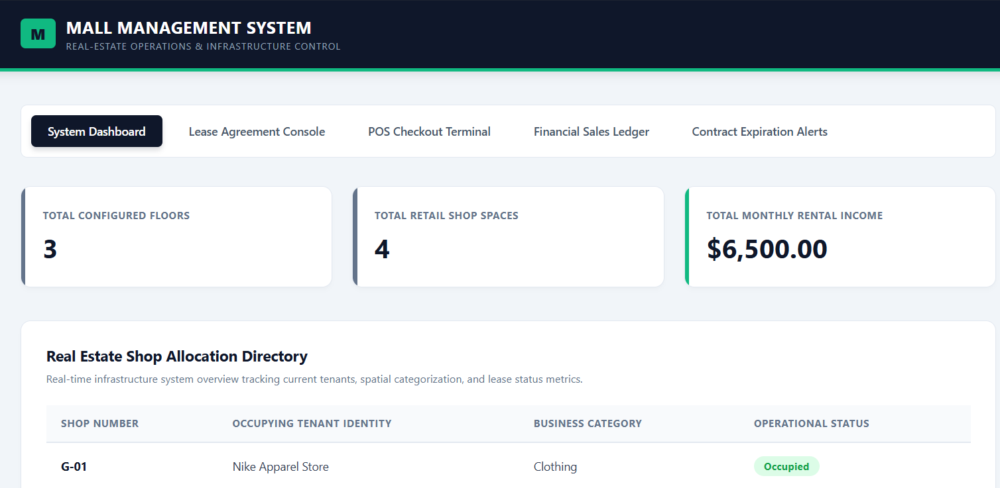
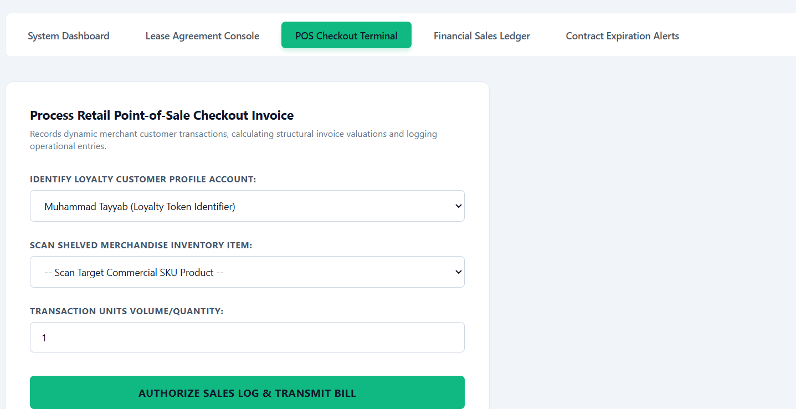
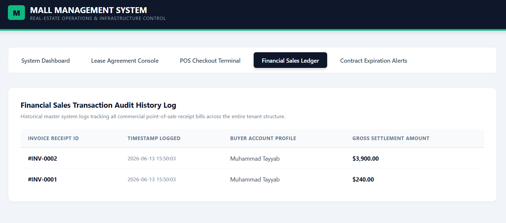
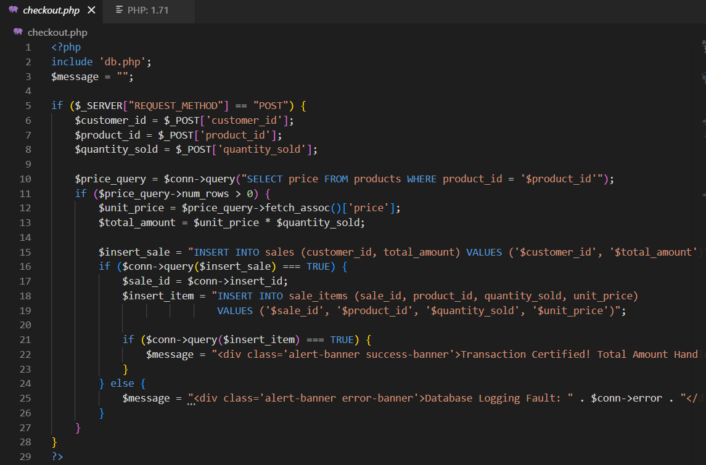

# Automated Shopping Mall Management System

A robust, three-layer relational database solution designed to seamlessly bridge real-estate infrastructure tracking, commercial lease contract enforcement, and retail point-of-sale (POS) operations into a unified system using **MySQL** and a **PHP/Vanilla Web Interface**.

---

## 🚀 Key Objectives & Architecture

The system shifts critical business logic away from the application layer directly into the database engine using advanced database mechanisms, achieving full compliance with **Third Normal Form (3NF)**.

### The 3-Layer Design

1. **Mall Infrastructure Layer:** Tracks physical property layouts (`floors` and `shops` tables) using rigid relational mapping.
2. **Business Contracts Layer:** Binds external merchants to distinct commercial slots via lease profiles. It enforces a strict **1:1 relationship constraint** ensuring a physical unit can hold only one active lease at any time.
3. **Retail Store Operations Layer:** Manages client loyalty identification, products, and checkout logs via a normalized master-detail pattern (`sales` and `sale_items`).

---

## 📊 System Previews & Interface

### 🖥️ Administrative System Dashboard
Real-time infrastructure system overview tracking current tenants, spatial categorization, and active lease metrics.

### 🛒 POS Checkout Terminal
Records dynamic merchant customer transactions, calculating structural invoice valuations, and logging real-time operational entries.

### 🧾 Financial Sales Ledger
Historical master system logs tracking all commercial point-of-sale receipt bills across the entire tenant structure.

### ⚠️ Contract Expiration Alerts
Isolation output query targeting the SQL Database View `v_expiring_leases` to intercept contract expiration boundaries proactively.

---

## 🛠️ Advanced Database Features

* **Event-Driven Triggers (`AFTER INSERT`):** Automates real-time inventory deduction down to the intersection table level (`sale_items`), protecting stock parameters against concurrent checkout attempts.
* **Abstracted Views (`v_expiring_leases`):** Combines operational parameters and complex date-calculation logic (`DATEDIFF`) to extract a real-time administrative pipeline of leases expiring within 30 days.
* **Cascading Referential Integrity:** Leverages structured `ON DELETE CASCADE` and `ON DELETE SET NULL` configurations to maintain absolute data hygiene and accounting history tracking.

### 💻 Backend Transaction Core (`checkout.php`)
Safe multi-table relational operations with immediate verification logs and error reporting.

---

## 💻 Tech Stack

* **Database Engine:** MySQL
* **Backend Core:** PHP (Procedural/Vanilla Data Mapping)
* **Frontend Design:** Tailwind CSS & Semantic HTML Components

---

## 📈 Database Schema & Constraints

| Parent Table | Child Table | Foreign Key Column | Relationship Type | Delete / Update Rule |
| :--- | :--- | :--- | :--- | :--- |
| `floors` | `shops` | `floor_id` | One-to-Many (1:N) | `ON DELETE CASCADE` |
| `shops` | `leases` | `shop_id` | One-to-One (1:1) | `ON DELETE CASCADE` |
| `shops` | `products` | `shop_id` | One-to-Many (1:N) | `ON DELETE CASCADE` |
| `customers` | `sales` | `customer_id` | One-to-Many (1:N) | `ON DELETE SET NULL` |
| `sales` | `sale_items`| `sale_id` | One-to-Many (1:N) | `ON DELETE CASCADE` |
| `products` | `sale_items`| `product_id` | One-to-Many (1:N) | `ON DELETE CASCADE` |

---

## 🔮 Future Roadmap Enhancements

* **Stored Procedures:** Encapsulate multi-step commercial interactions (e.g., automated checkout loops, dynamic lease renewals) directly into optimized database routines.
* **MVC Migration:** Refactor the vanilla PHP structural scripts into an architectural enterprise setup utilizing **Laravel Eloquent ORM**.
* **Cron Scheduled Automation:** Integrate the MySQL Event Scheduler to dispatch automatic warning transmissions when the expiry target view hits true matches.
